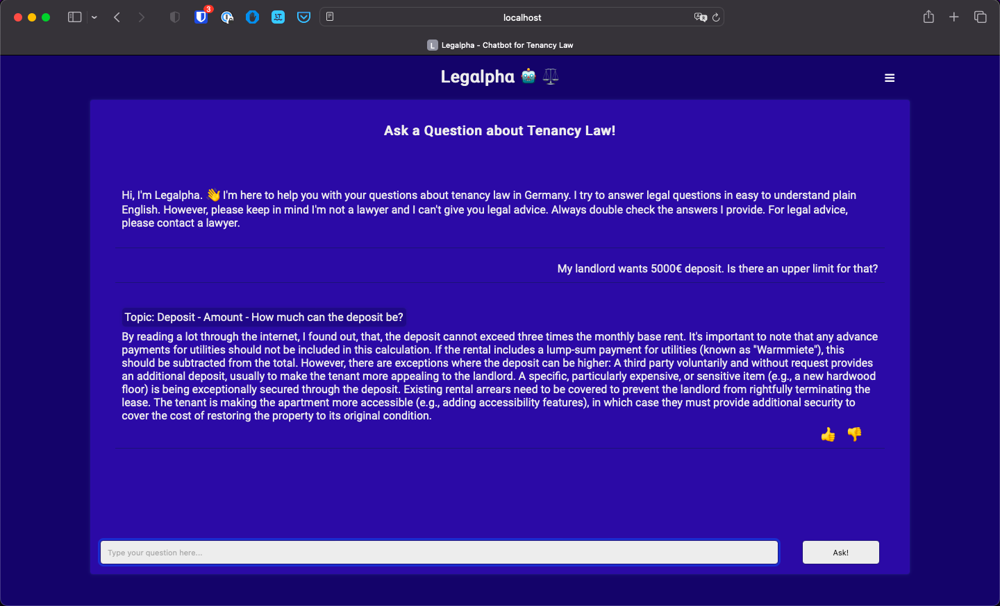
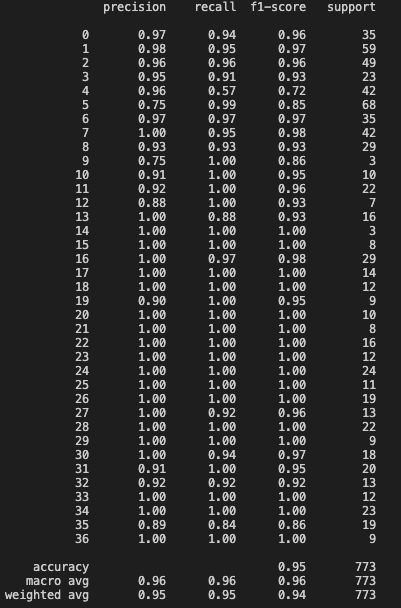
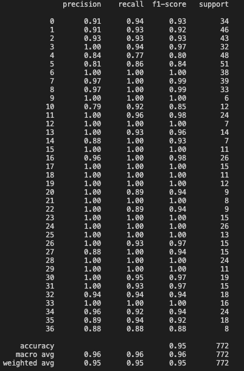

# Legalpha

## Chatbot for Tenancy Law Questions 🤖 ⚖️

*** Work in progress ***

## Problem
For equal rights, everyone should have equal access to legal information.

## Solution
A chatbot giving easy to digest answers to law questions
- Free for everyone to use
- With paragraph references to prevent disinformation

### Scope
The scope of this project is limited to tenancy law in Germany for now.

Current topics covered:
1. Contract termination
2. Deposit

## How to contribute?
### Contribute to the question dataset
Submit sample questions about tenancy law to train Legalpha using <a href="https://airtable.com/shrxkifiAiuAFO8Cl
">this form</a>.

### Contribute to tasks
You can also contribute to the tasks regarding the following topics:
- Data collection
- Legal research
- ML / NLP
- Frontend Development
- Backend Development

To contribute, please contact me <a href='https://www.linkedin.com/in/ege-atmaca/'>here</a>. 

## How to run the code?
### Prerequisites
- Docker
- Docker Compose

### Run the server
1. Clone the repository
2. Run `docker compose up` in the root directory
3. Open `localhost:8000` in your browser

### Run ML jobs
`docker compose up` with respective commands.
1. Tune hyperparameters: `python main.py --tune --model-name <MODEL_NAME> --tune-iters <ITERS> --tune-cv-folds <FOLDS>`
2. Test the model with default parameters: `python main.py --test --model-name <MODEL_NAME> --test-size <TEST_FRACTION> --test-sampling <SAMPLING_STRATEGY>`
3. Train and save the model with default parameters: `python main.py --train`

## Test Results
### Random Sampling

### Stratified Sampling
